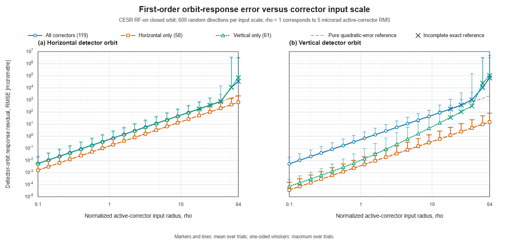
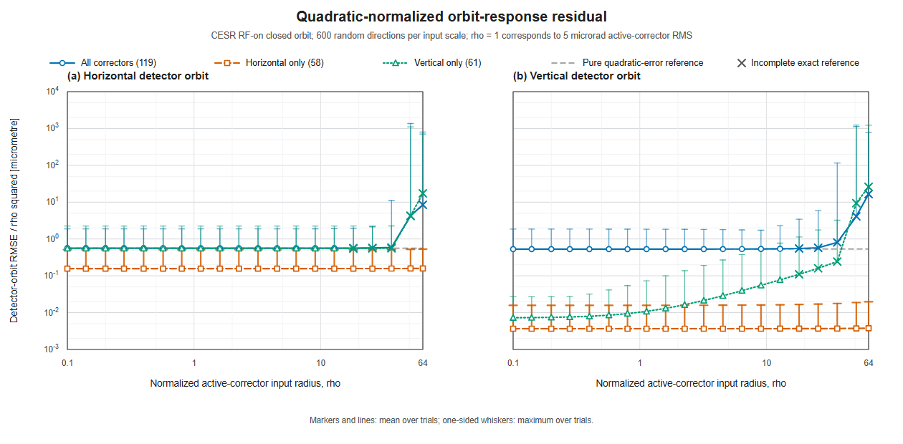

# SciBmad orbit-response approximation error analysis

## Purpose

This study measures the validity range of the nominal first-order SciBmad
detector-orbit response matrix. For a corrector perturbation `delta_k`, the
linear prediction is compared with a converged nonlinear RF-on closed-orbit
calculation at all 99 horizontal and 99 vertical detectors.

The experiment addresses three questions:

1. How do the approximation errors differ when all 119 correctors, only the 58
   horizontal correctors, or only the 61 vertical correctors are varied?
2. Over what input range is the residual governed by the expected quadratic
   truncation term, and where do higher-order terms become important?
3. Given an application-specific output-error budget, what active-corrector RMS
   perturbation can be accepted?

## Code and layout

The error-analysis code is colocated with its results:

- `run_response_rho_sweep.jl`: generate exact/linear paired sweep data;
- `run_response_rho_sweep_parallel.ps1`: run the maintained five-chunk sweep;
- `merge_response_rho_sweep_chunks.py`: merge chunk outputs;
- `analyze_response_rho_scaling.py`: calculate normalized errors and slopes;
- `render_response_rho_sweep_svg.py`: dependency-free SVG rendering;
- `response_rho_sweep_600/`: committed sweep results and figures;
- `vertical_parity/`: signed-direction experiment, analysis, and report.

From `CESR Project`, a short sweep can be run with:

```console
julia --project=. dataset_benchmark/orbit/error_analysis/run_response_rho_sweep.jl \
  --rhos=0,0.5,1 --trials=4
```

The complete Windows workflow starts from:

```powershell
powershell -ExecutionPolicy Bypass -File `
  dataset_benchmark/orbit/error_analysis/run_response_rho_sweep_parallel.ps1
```

Shared inputs come from the sibling `../Orbit_Calculation/inputs/` directory;
the validated response cache remains in `../reference/`.

The results characterize the **SciBmad model and lattice used by this run**.
They are not yet a machine-validated CESR error budget.

## Data and figures

- `response_rho_sweep_600/combined/rho_sweep_trial_errors.csv`: all trial-level
  residual metrics.
- `response_rho_sweep_600/combined/rho_sweep_summary.csv`: mean and observed
  maximum over 600 random directions at each positive `rho`.
- `response_rho_sweep_600/combined/rho_sweep_scaling.csv`: `E/rho^2` and local
  log-log slopes.
- `response_rho_sweep_600/combined/rho_sweep_metadata.json`: combined run
  metadata and convergence counts.
- `response_rho_sweep_600/chunks/`: the five original parallel chunks, logs,
  and metadata.
- `response_rho_sweep_600/figures/`: publication-style PNG and SVG figures.





## Experimental definition

For each scenario, a Gaussian random direction is normalized to exact unit RMS
over the active correctors. The applied perturbation is

```text
delta_k = rho * (5 microrad) * normalized_direction.
```

Consequently, `rho = 1` means an active-corrector RMS kick of `5 microrad`.
This is an RMS over the active subset, not the maximum kick of one corrector and
not an RMS over all 119 columns for the single-plane scenarios.

The sweep contains 20 approximately logarithmic positive radii from `0.1` to
`64`, with 600 random directions per scenario and radius. The same directions
are reused across radii. Including one shared nominal state, the run evaluates

```text
1 + 3 scenarios * 20 radii * 600 trials = 36,001 nonlinear states.
```

For plane `u` in `{x, y}`, the plotted mean error is

```text
E_s,u(rho) = mean over trials of the detector RMSE in plane u,
```

where each trial RMSE is taken over the 99 detectors in that plane. The
one-sided whisker is the largest trial RMSE among the 600 directions. It is an
**observed maximum**, not a standard deviation, confidence interval, or formal
probabilistic upper bound.

All 600 trials converge through `rho = 12.8` for all three scenarios.
Horizontal-only remains complete through `rho = 64`. All-corrector and
vertical-only results are incomplete from `rho = 18.1` onward; their high-rho
means use only converged trials and may therefore be selection-biased.

## Why a quadratic error is expected

Expanding the exact detector orbit around the nominal corrector setting gives

```text
orbit(delta_k) = orbit(0)
               + J delta_k
               + (1/2) H[delta_k, delta_k]
               + (1/6) T[delta_k, delta_k, delta_k] + ...
```

The response-matrix approximation retains only `J delta_k`. Its leading
residual is therefore normally quadratic. If the quadratic tensor contraction
is small or canceled for a particular input/output combination, a cubic or
higher term can become visible much earlier.

Two diagnostics are used:

```text
Q(rho) = E(rho) / rho^2
p_i = log(E_i / E_(i-1)) / log(rho_i / rho_(i-1)).
```

Pure quadratic scaling gives constant `Q` and local slope `p = 2`. In this
README, "near-quadratic" is used operationally when `|p - 2| <= 0.05` and `Q`
changes by no more than 10% from its smallest-rho value. "Higher-order
dominated" is reserved for a sustained large departure, approximately
`p >= 2.5` together with `Q/Q(rho=0.1) >= 2`. These are analysis criteria, not
machine-protection limits.

## Difference among the three corrector scenarios

The low-rho quadratic coefficients below are evaluated at `rho = 0.1`. Units
are micrometres of mean detector RMSE per `rho^2`.

| Active correctors | X-orbit coefficient | Y-orbit coefficient |
|---|---:|---:|
| All 119 | 0.5648 | 0.5321 |
| Horizontal only (58) | 0.1570 | 0.003660 |
| Vertical only (61) | 0.5524 | 0.007270 |

### X orbit: all correctors and vertical-only are nearly the same

Across the complete common range `0.1 <= rho <= 12.8`, the all-corrector X
mean RMSE is only 2.14-2.25% above the vertical-only value. At `rho = 1.13`,

| Scenario | X mean RMSE |
|---|---:|
| All correctors | 0.7211 micrometre |
| Vertical only | 0.7053 micrometre |
| Horizontal only | 0.2005 micrometre |

Thus, at this radius, all-corrector X error is 1.022 times vertical-only but
3.60 times horizontal-only. The most direct interpretation is that the
quadratic X residual is dominated by the vertical-corrector block. Combining
the smaller horizontal contribution with the vertical contribution changes
the total RMSE only slightly.

This interpretation is consistent with the measured coefficients, but it is
not yet a tensor-level proof. A follow-up Hessian block decomposition into
`H_hh`, `H_hv`, and `H_vv` would be required to attribute the effect to
specific second-order terms or lattice elements.

### Y orbit: simultaneous H/V variation reveals a large mixed contribution

At `rho = 1.13`, the Y mean RMSE values are

| Scenario | Y mean RMSE |
|---|---:|
| All correctors | 0.6792 micrometre |
| Vertical only | 0.01383 micrometre |
| Horizontal only | 0.004675 micrometre |

The all-corrector value is about 49 times vertical-only and 145 times
horizontal-only. Neither single-plane experiment reproduces the all-corrector
Y error. The data therefore strongly suggest that mixed horizontal-vertical
quadratic terms, present only when both corrector families vary together,
dominate the all-corrector Y residual. A Hessian block calculation is again
needed to confirm the attribution directly.

The comparison also explains why one should not infer the all-corrector error
by taking the larger of the two single-plane curves: the mixed term can be much
larger than either isolated term.

## Quadratic and higher-order regimes

| Scenario and output | Observed regime | Interpretation |
|---|---|---|
| All -> X | Near-quadratic through the last complete point, `rho = 12.8` (`64 microrad` RMS). A mild departure appears near `rho = 36.2`; strong growth occurs at `rho >= 51.2`, but these points are incomplete. | Quadratic residual is established over the validated range; the high-rho transition is only provisional. |
| All -> Y | Near-quadratic through `rho = 12.8`. Local slope reaches about 2.13 at `rho = 25.6` and 2.97 at `rho = 36.2`, both incomplete. | Higher-order effects probably emerge beyond the complete range, but their population mean is not yet validated. |
| Horizontal only -> X | Near-quadratic through `rho = 64` (`320 microrad` RMS); final slope is 2.011 and `Q` changes by about 1%. | No higher-order-dominated transition is observed in the scanned range. |
| Horizontal only -> Y | Near-quadratic through `rho = 64`; final slope is 2.047 and `Q` changes by about 3%. | The cross-plane residual is small and remains predominantly quadratic in the scanned range. |
| Vertical only -> X | Scaling remains close to quadratic through `rho = 36.2`, but exact-reference completeness ends after `rho = 12.8`. Strong growth appears at `rho >= 51.2`. | The complete range supports quadratic behavior; the apparent high-rho transition requires a more robust exact solve. |
| Vertical only -> Y | Strictly near-quadratic only at the smallest radii (`rho <= 0.2`). Departure begins around `rho = 0.28-0.4`; higher-order terms are comparable or dominant by `rho = 2.26`, where `p = 2.66` and `Q/Q_0 = 2.25`. The slope approaches 3 from `rho = 6.4` to `12.8`. | The quadratic Y term is unusually small, allowing an approximately cubic contribution to dominate early. This transition occurs while all 600 references still converge and is therefore the clearest verified higher-order effect. |

At `rho = 12.8`, the complete-reference mean RMSE values further illustrate
the anisotropy:

| Scenario | X mean RMSE | Y mean RMSE |
|---|---:|---:|
| All correctors | 92.55 micrometres | 88.79 micrometres |
| Horizontal only | 25.74 micrometres | 0.6011 micrometre |
| Vertical only | 90.60 micrometres | 12.71 micrometres |

## Converting an output-error budget into an input limit

There is no universal acceptable orbit-response approximation error. The
budget must be chosen from the downstream task: BPM noise and calibration,
required orbit stability, correction residual, aperture margin, or a specified
fraction of the physical orbit change. It must not be inferred from the closed
orbit solver tolerance.

In a verified quadratic regime, if

```text
E(rho) = C2 * rho^2,
```

then an output budget `epsilon` gives

```text
rho_limit = sqrt(epsilon / C2)
active-corrector RMS limit = 5 * rho_limit microrad.
```

The following table uses log-log interpolation of the measured mean curve. A
cell reports `rho / active-corrector RMS kick`. Values are sensitivity examples,
not proposed CESR specifications.

| Scenario and output | 1 micrometre mean budget | 10 micrometre mean budget | 100 micrometre mean budget |
|---|---:|---:|---:|
| All -> X | 1.33 / 6.65 microrad | 4.21 / 21.0 microrad | 13.31 / 66.5 microrad [incomplete bracket] |
| All -> Y | 1.37 / 6.86 microrad | 4.33 / 21.7 microrad | 13.56 / 67.8 microrad [incomplete bracket] |
| Horizontal only -> X | 2.52 / 12.6 microrad | 7.98 / 39.9 microrad | 25.21 / 126 microrad |
| Horizontal only -> Y | 16.50 / 82.5 microrad | 51.70 / 259 microrad | Not reached by `rho = 64` / `320 microrad` |
| Vertical only -> X | 1.35 / 6.73 microrad | 4.25 / 21.3 microrad | 13.45 / 67.2 microrad [incomplete bracket] |
| Vertical only -> Y | 5.43 / 27.2 microrad [higher-order] | 11.82 / 59.1 microrad [higher-order] | 25.21 / 126 microrad [higher-order and incomplete] |

For example, if the accepted **mean** approximation error is 1 micrometre,
all-corrector operation crosses that budget at an active-corrector RMS kick of
about `6.7 microrad` in either detector plane. Horizontal-only Y remains below
the same budget until about `82.5 microrad`. Vertical-only Y crosses at about
`27.2 microrad`, but this crossing must be obtained from the measured curve,
not from a pure quadratic extrapolation, because the curve is already becoming
cubic.

If the requirement is that none of the 600 sampled directions exceed 1
micrometre, the observed-maximum crossings are more conservative:

| Scenario and output | `rho` at 1 micrometre observed maximum | Active-corrector RMS kick |
|---|---:|---:|
| All -> X | 0.730 | 3.65 microrad |
| All -> Y | 0.736 | 3.68 microrad |
| Horizontal only -> X | 1.397 | 6.98 microrad |
| Horizontal only -> Y | 7.874 | 39.4 microrad |
| Vertical only -> X | 0.667 | 3.33 microrad |
| Vertical only -> Y | 2.545 | 12.7 microrad |

These maximum-based values are properties of this finite set of 600 random
directions. A formal high-confidence bound would require a chosen risk level
and additional tail estimation or substantially more trials near the proposed
operating boundary.

## Relation to recent accelerator literature

The interpretation follows current accelerator practice but does not borrow a
numerical tolerance from another machine:

- X. Huang, ["Correction of nonlinear lattice with closed orbit
  modulation," IPAC 2024, THPC32](https://doi.org/10.18429/JACoW-IPAC2024-THPC32),
  explicitly separates small-amplitude data governed by linear optics from
  large-amplitude modulation that exposes lattice nonlinearity. This supports
  scanning the excitation amplitude and diagnosing the transition with a
  normalized scaling curve rather than assuming one response matrix is valid
  at every amplitude.
- C. Caliari, A. Oeftiger, and O. Boine-Frankenheim,
  ["Beam-based identification of magnetic field errors in a synchrotron using
  deep Lie map networks," PRAB 28, 024601
  (2025)](https://doi.org/10.1103/PhysRevAccelBeams.28.024601), distinguishes
  linearized ORM information from measurements designed to recover nonlinear
  multipole behavior. This is consistent with treating the response matrix as
  a local first-order model and testing nonlinear validity separately.
- V. Isensee, A. Oeftiger, and O. Boine-Frankenheim,
  ["Uncertainty-Quantified Machine Model Construction Using Physics-Informed
  Gaussian Processes and Bayesian Optimization," IPAC 2025,
  THPM017](https://doi.org/10.18429/JACoW-IPAC2025-THPM017), emphasizes that
  orbit-model predictions should include BPM noise, parameter distributions,
  and uncertainty between monitors. This is why the present truncation error
  should eventually be combined with, but not confused with, measurement and
  machine-model uncertainty.
- W. Lin et al., ["Machine learning assisted Bayesian calibration of
  accelerator digital twin from orbit response data," NAPAC 2025,
  MOP056](https://doi.org/10.18429/JACoW-NAPAC2025-MOP056), calibrates a Bmad
  digital twin using measured orbit responses and propagates parameter and BPM
  errors to prediction uncertainty. It provides a direct recent precedent for
  reporting model discrepancy and measurement uncertainty separately.
- J. Fan et al., ["Application of ensemble machine learning algorithms and
  filtering techniques in slow orbit feedback systems of electron storage
  rings," PRAB 28, 042801
  (2025)](https://doi.org/10.1103/PhysRevAccelBeams.28.042801), notes both the
  practical usefulness of the linear ORM relation and its limitations in
  nonlinear or changing machine conditions. It also reinforces that an
  acceptance budget is tied to the orbit-control objective and noise
  environment of the facility.

The cited machines use different lattices, corrector calibrations, BPM systems,
and operational objectives. Their numerical errors are therefore context, not
transferable CESR acceptance limits.

## Limitations and next steps

1. **Define the actual acceptance budget.** Repeat the crossing table using the
   CESR application requirement for mean error, a selected percentile, and/or
   worst-case error.
2. **Resolve the incomplete high-rho references.** Rerun all-corrector and
   vertical-only samples from `rho = 18.1` with a more robust continuation or
   exact solver before making population claims about the high-rho transition.
3. **Decompose the second-order response.** Compute or estimate Hessian blocks
   `H_hh`, `H_hv`, and `H_vv` to test the proposed explanation for the nearly
   identical all/vertical X curves and the large all-corrector Y residual.
4. **Densify transition regions rather than the entire scan.** Add radii around
   `rho = 0.2-2.5` for vertical-only Y and around `rho = 25-55` for the
   high-rho all/vertical transitions.
5. **Add uncertainty layers.** Combine response truncation error with BPM noise,
   calibration uncertainty, lattice/model discrepancy, and real CESR response
   measurements. Until this is done, the result validates a SciBmad
   approximation against nonlinear SciBmad, not a digital twin against CESR.

## Signed-parity follow-up

A signed vertical-corrector experiment was completed on 2026-08-04 to test the
order of the early `vertical-only -> y` transition directly. The same 100
random directions were evaluated at both signs for 15 radii over
`0.05 <= rho <= 6.4`; all 3,001 nonlinear states converged.

The paired decomposition shows that the vertical detector-orbit even component
has slope 2, while the odd component after subtraction of the linear response
has slope 3. Their mean RMSE values cross near `rho = 1.31`, or approximately
`6.5 microrad` active-corrector RMS. At `rho = 6.4`, the mean odd/even ratio is
`4.91`. The horizontal detector-orbit control remains overwhelmingly
even/quadratic, with an odd/even ratio of only `3.05e-4` at the same radius.

This confirms that the green curve leaves the pure-quadratic reference because
an odd cubic contribution overtakes a small even quadratic contribution. It
does not yet attribute the cubic coefficient to sextupole composition,
octupoles, wigglers, or another nonlinear element. See
[`vertical_parity/`](vertical_parity/) for the runnable experiment, analysis
code, numerical result, and direction dependence.
