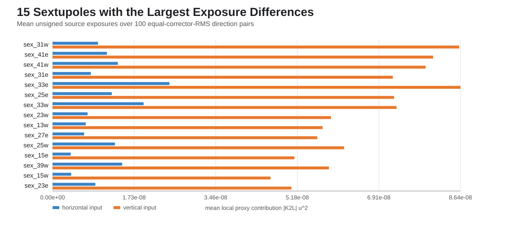
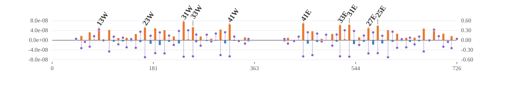

# Element-local normal-sextupole exposure result

Result recorded 2026-08-06. The analysis uses 100 equal-corrector-RMS H/V direction pairs and all 76 active normal sextupoles.

## Global closure

- Mean horizontal unsigned source exposure: `7.48571813e-07`.
- Mean vertical unsigned source exposure: `1.77256368e-06`.
- Ratio of mean exposures: `2.367927`.
- Maximum element-sum closure relative residual: `7.330e-16`.
- Pearson correlation between signed K2L and mean exposure excess: `-0.827394`; `66/76` sites have opposite signs.
- The top 13 elements supply 50% of mean vertical exposure; the top 11 positive-excess elements supply 50% of the positive vertical-minus-horizontal excess.

The ratio of means is not the median of direction-level ratios quoted in the first-stage result. This is an unsigned local-source proxy and does not contain signed K2 cancellation or transport from each sextupole to the detectors.

## Largest mean vertical exposure

| rank | element | s [m] | K2L [m^-2] | mean Ev | vertical share | mean Eh |
|---:|---|---:|---:|---:|---:|---:|
| 1 | `sex_33e` | 516.053 | -0.49392 | 8.6403e-08 | 4.87% | 2.4751e-08 |
| 2 | `sex_31w` | 235.741 | -0.50427 | 8.6135e-08 | 4.86% | 9.6190e-09 |
| 3 | `sex_41e` | 450.156 | -0.49661 | 8.0606e-08 | 4.55% | 1.1508e-08 |
| 4 | `sex_41w` | 318.272 | -0.49659 | 7.9025e-08 | 4.46% | 1.3814e-08 |
| 5 | `sex_33w` | 252.373 | -0.49415 | 7.2869e-08 | 4.11% | 1.9282e-08 |
| 6 | `sex_25e` | 583.669 | -0.39789 | 7.2351e-08 | 4.08% | 1.2541e-08 |
| 7 | `sex_31e` | 532.687 | -0.50422 | 7.2068e-08 | 4.07% | 8.1084e-09 |
| 8 | `sex_25w` | 184.758 | -0.39794 | 6.1753e-08 | 3.48% | 1.3209e-08 |
| 9 | `sex_23w` | 166.350 | -0.5234 | 5.8956e-08 | 3.33% | 7.4157e-09 |
| 10 | `sex_39w` | 301.861 | -0.4572 | 5.8541e-08 | 3.30% | 1.4746e-08 |
| 11 | `sex_13w` | 83.933 | 0.32584 | 5.7195e-08 | 3.23% | 7.0254e-09 |
| 12 | `sex_27e` | 567.035 | -0.40347 | 5.6071e-08 | 3.16% | 6.6802e-09 |

## Largest mean vertical-minus-horizontal excess

| rank | element | station | mean Ev-Eh | positive-excess share | directions Ev>Eh |
|---:|---|---|---:|---:|---:|
| 1 | `sex_31w` | `SEX_31` | 7.6516e-08 | 6.14% | 79.0% |
| 2 | `sex_41e` | `SEX_41` | 6.9099e-08 | 5.55% | 81.0% |
| 3 | `sex_41w` | `SEX_41` | 6.5211e-08 | 5.24% | 79.0% |
| 4 | `sex_31e` | `SEX_31` | 6.3959e-08 | 5.14% | 79.0% |
| 5 | `sex_33e` | `SEX_33` | 6.1652e-08 | 4.95% | 72.0% |
| 6 | `sex_25e` | `SEX_25` | 5.9810e-08 | 4.80% | 73.0% |
| 7 | `sex_33w` | `SEX_33` | 5.3587e-08 | 4.30% | 69.0% |
| 8 | `sex_23w` | `SEX_23` | 5.1540e-08 | 4.14% | 78.0% |
| 9 | `sex_13w` | `SEX_13` | 5.0170e-08 | 4.03% | 72.0% |
| 10 | `sex_27e` | `SEX_27` | 4.9390e-08 | 3.97% | 82.0% |
| 11 | `sex_25w` | `SEX_25` | 4.8543e-08 | 3.90% | 70.0% |
| 12 | `sex_15e` | `SEX_15` | 4.7366e-08 | 3.80% | 87.0% |

## Largest East/West station-pair excess

| rank | pair | mean Ev-Eh | positive-excess share | directions Ev>Eh |
|---:|---|---:|---:|---:|
| 1 | `SEX_31` | 1.4048e-07 | 11.28% | 92.0% |
| 2 | `SEX_41` | 1.3431e-07 | 10.78% | 90.0% |
| 3 | `SEX_33` | 1.1524e-07 | 9.25% | 79.0% |
| 4 | `SEX_25` | 1.0835e-07 | 8.70% | 82.0% |
| 5 | `SEX_23` | 9.3077e-08 | 7.47% | 87.0% |
| 6 | `SEX_27` | 9.0615e-08 | 7.28% | 92.0% |
| 7 | `SEX_15` | 8.9573e-08 | 7.19% | 93.0% |
| 8 | `SEX_13` | 8.8765e-08 | 7.13% | 83.0% |
| 9 | `SEX_39` | 8.0567e-08 | 6.47% | 75.0% |
| 10 | `SEX_11` | 5.9745e-08 | 4.80% | 89.0% |

## Ring-side control

| side | mean Eh | mean Ev | mean Ev-Eh |
|---|---:|---:|---:|
| E | 3.7733e-07 | 8.8660e-07 | 5.0927e-07 |
| W | 3.7124e-07 | 8.8596e-07 | 5.1472e-07 |

## K2-sign location groups

Exposure itself uses |K2L|. The sign below is therefore a label for the two alternating sextupole-location classes, not a signed-kick decomposition.

| location group | elements | mean sum yv^2 / mean sum xh^2 | mean Ev/Eh | mean Ev-Eh | net-excess share |
|---|---:|---:|---:|---:|---:|
| `negative_K2` | 40 | 3.7127 | 5.0142 | 1.1417e-06 | 111.49% |
| `positive_K2` | 36 | 0.5814 | 0.7464 | -1.1770e-07 | -11.49% |

## Physical interpretation of the proxy

The first four station pairs (`SEX_31`, `SEX_41`, `SEX_33`, and `SEX_25`) supply `40.01%` of the positive excess. East and West totals agree to within about one percent of their mean, so the localization is a nearly ring-symmetric optics pattern rather than a one-sided outlier.

The negative-K2 location class has an unweighted mean orbit-squared ratio of `3.7127` before K2 weighting and a weighted exposure ratio of `5.0142`. The positive-K2 class instead has ratios `0.5814` and `0.7464`. Thus the excess originates primarily because the alternating negative-K2 sextupole locations sample much larger vertical than horizontal internal-orbit response; the positive-K2 locations partially cancel that imbalance at the unsigned-proxy level.

This is consistent with the two sextupole location classes occupying different horizontal/vertical optics. A beta-, tune-, and phase-resolved response-matrix decomposition is still required before assigning the contrast to a specific linear-optics factor.

## Evidence boundary

This ranking identifies where the unsigned normal-sextupole source proxy is generated. It is not yet a ranking of signed detector response. The next causal step is a signed detector-vector reconstruction or recomputed-lattice ablation of the leading elements/pairs.
