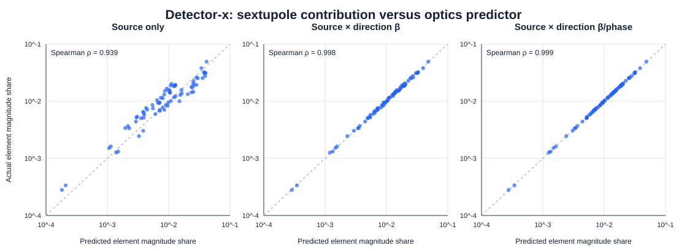
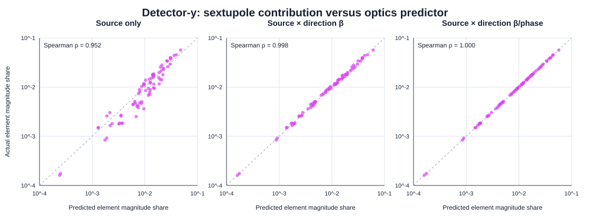

# Sextupole contribution correlation with beta and phase

## Scope

This experiment reuses the 100 fixed corrector-direction pairs, the saved first-order sextupole orbit exposure, and the maintained thick-element Hessian contribution norms. RF-on Twiss functions and sextupole-to-detector phase advances are calculated both at the nominal state and separately at every simultaneous h+v direction state.

The saved thick-element contribution is a 99-detector vector norm for each sextupole and direction. Therefore the beta/phase predictors are also assembled as 99-detector vectors and reduced with the same Euclidean norm. No existing contribution is recomputed.

## Predictors

- `source_only`: the dominant-plane thin-sextupole local source, `|K2L (x_h^2-y_v^2)/2|` for detector-x and `|K2L x_h y_v|` for detector-y.
- `nominal_beta_envelope` and `direction_beta_envelope`: the source multiplied by the L2 norm over detectors of `sqrt(beta_i beta_j)/(2 |sin(pi Q)|)`, using nominal or direction-matched optics.
- `nominal_beta_phase` and `direction_beta_phase`: the corresponding envelope including `cos(2 pi |phi_j-phi_i| - pi Q)` before the detector-vector norm.

The mode-1 Twiss functions are used as the x-like predictor and mode-2 as the y-like predictor. These are uncoupled-style proxies; the exact thick contribution retains the full coupled six-dimensional transport.

## Correlations

| plane | predictor | pooled Spearman | pooled log Pearson | direction Spearman median [P10, P90] | element Spearman | element log Pearson |
|---|---|---:|---:|---:|---:|---:|
| x | `source_only` | 0.9784 | 0.9777 | 0.9769 [0.9661, 0.9847] | 0.9385 | 0.9576 |
| x | `nominal_beta_envelope` | 0.9993 | 0.9923 | 0.9989 [0.9975, 0.9994] | 0.9984 | 0.9994 |
| x | `direction_beta_envelope` | 0.9993 | 0.9923 | 0.9989 [0.9975, 0.9993] | 0.9985 | 0.9994 |
| x | `nominal_beta_phase` | 0.9995 | 0.9924 | 0.9993 [0.9978, 0.9996] | 0.9993 | 0.9999 |
| x | `direction_beta_phase` | 0.9995 | 0.9924 | 0.9993 [0.9978, 0.9996] | 0.9993 | 0.9999 |
| y | `source_only` | 0.9781 | 0.9749 | 0.9746 [0.9693, 0.9797] | 0.9517 | 0.9623 |
| y | `nominal_beta_envelope` | 0.9983 | 0.9910 | 0.9978 [0.9949, 0.9987] | 0.9981 | 0.9989 |
| y | `direction_beta_envelope` | 0.9983 | 0.9910 | 0.9978 [0.9949, 0.9987] | 0.9981 | 0.9989 |
| y | `nominal_beta_phase` | 0.9988 | 0.9913 | 0.9988 [0.9963, 0.9997] | 0.9998 | 1.0000 |
| y | `direction_beta_phase` | 0.9988 | 0.9913 | 0.9988 [0.9963, 0.9996] | 0.9998 | 1.0000 |

## Direction-optics variation from nominal

| quantity | median absolute relative change | P90 | maximum |
|---|---:|---:|---:|
| `sextupole_beta_1` | 2.201e-03 | 5.785e-03 | 1.253e-02 |
| `detector_beta_1` | 2.211e-03 | 6.014e-03 | 6.859e-02 |
| `sextupole_beta_2` | 1.325e-03 | 3.373e-03 | 1.189e-02 |
| `detector_beta_2` | 1.295e-03 | 3.400e-03 | 6.615e-02 |
| `transport_envelope_x_l2` | 1.130e-03 | 2.962e-03 | 6.621e-03 |
| `transport_phase_x_l2` | 3.275e-04 | 8.922e-04 | 3.178e-03 |
| `transport_envelope_y_l2` | 8.012e-04 | 1.945e-03 | 6.543e-03 |
| `transport_phase_y_l2` | 5.235e-04 | 1.431e-03 | 3.718e-03 |

## Interpretation boundary

A correlation increase from `source_only` to a beta-envelope predictor measures the additional ranking information supplied by the beta functions. A further increase for the phase-aware predictor measures the value of phase advance for predicting the detector-vector magnitude. Comparing nominal and direction-matched rows tests whether orbit-dependent feed-down optics materially changes that relationship. This is still an association study, not a controlled beta-beating scan.

The orbit file retains the dominant `x_h` and `y_v` local responses but not the smaller cross-plane `x_v` and `y_h` responses. The proxy therefore does not attempt to reproduce the exact coupled local Hessian source. Residual disagreement may come from those cross-plane terms, solenoidal coupling, finite-length sourcing, and non-sextupole complete-element sources.

## Reused inputs

- Orbit exposure: `D:\Ring_Design_Development\CESR Project\dataset_benchmark\orbit\error_analysis\quadratic_x_attribution\element_results\element_exposure_directions.csv`
- Horizontal contribution: `D:\Ring_Design_Development\CESR Project\dataset_benchmark\orbit\error_analysis\thick_element_sextupole_sourcing\horizontal_results\thick_sextupole_direction_contributions.csv`
- Vertical contribution: `D:\Ring_Design_Development\CESR Project\dataset_benchmark\orbit\error_analysis\thick_element_sextupole_sourcing\vertical_results\thick_sextupole_direction_contributions.csv`
