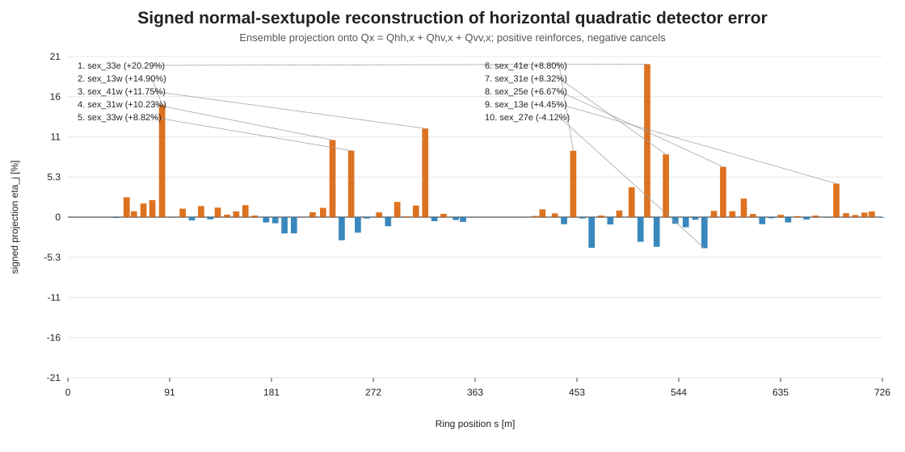

# Signed normal-sextupole detector-contribution result

Positive signed projection reinforces the target and negative projection cancels it.

## Reconstruction closure

- Directions: `100`.
- Active normal sextupoles: `76`.
- HH concatenated relative closure: `0.493677`.
- HV concatenated relative closure: `0.358913`.
- VV concatenated relative closure: `0.202782`.
- Total concatenated relative closure: `0.301381`.
- Total reconstruction signed projection: `0.919411`.
- Direction-level total closure P10 / median / P90: `0.214475 / 0.314713 / 0.522344`.
- Direction-level signed projection P10 / median / P90: `0.772134 / 0.91932 / 0.97001`.

## Interpretation

The total concatenated residual is 30.14%, so this calculation does not close tightly enough to be presented as a complete per-sextupole attribution of the final detector error. The ranking below is a signed projection of the leading thin normal-sextupole reconstruction; the residual must remain explicit.

## Largest absolute signed projections

| rank | sextupole | s [m] | K2L [m^-2] | eta total | magnitude ratio |
|---:|---|---:|---:|---:|---:|
| 1 | `sex_33e` | 516.053 | -0.49392 | +20.2888% | 62.0486% |
| 2 | `sex_13w` | 83.933 | 0.32584 | +14.8982% | 39.3084% |
| 3 | `sex_41w` | 318.272 | -0.49659 | +11.7539% | 38.8782% |
| 4 | `sex_31w` | 235.741 | -0.50427 | +10.2258% | 34.9110% |
| 5 | `sex_33w` | 252.373 | -0.49415 | +8.8189% | 47.7332% |
| 6 | `sex_41e` | 450.156 | -0.49661 | +8.8030% | 39.5617% |
| 7 | `sex_31e` | 532.687 | -0.50422 | +8.3175% | 31.9632% |
| 8 | `sex_25e` | 583.669 | -0.39789 | +6.6667% | 40.7192% |
| 9 | `sex_13e` | 684.498 | 0.326 | +4.4464% | 25.9601% |
| 10 | `sex_27e` | 567.035 | -0.40347 | -4.1171% | 24.1054% |
| 11 | `sex_39e` | 466.563 | -0.45728 | -4.0721% | 28.6620% |
| 12 | `sex_35e` | 502.186 | -0.16514 | +3.9525% | 19.9638% |
| 13 | `sex_32e` | 524.486 | 0.30635 | -3.9369% | 17.7581% |
| 14 | `sex_34e` | 510.105 | 0.17428 | -3.2748% | 25.3401% |
| 15 | `sex_32w` | 243.940 | 0.30628 | -3.0639% | 17.9038% |

## Evidence boundary

The signed projection is additive only to the extent that the propagated local-source vectors reconstruct the GTPSA target. The magnitude ratio is not additive. If closure is not small, retain this as a leading thin-kick normal-sextupole reconstruction and keep the residual explicit.

