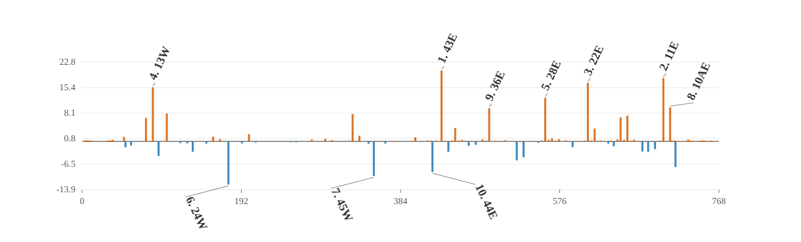

# Detector-x complete-element nonlinear-error attribution

## Summed nonlinear target and vector closure

- Directions: `1`; lattice elements: `1177`; active normal sextupoles: `76`; detectors: `144`.
- All-element total relative closure: `4.23146e-15`.
- Ensemble total signed projection of all element vectors: `1`.
- Direction-level total closure P10 / median / P90: `4.23146e-15 / 4.23146e-15 / 4.23146e-15`.
- Direction-level signed projection P10 / median / P90: `1 / 1 / 1`.
- Family-vector partition maximum absolute error: `1.45319e-20 m`.
- Family-vector partition relative closure maximum: `7.54499e-15`.
- Direction-level family partition relative closure P10 / median / P90: `7.54499e-15 / 7.54499e-15 / 7.54499e-15`.

The target is the summed leading second-order nonlinear detector vector. Signed projections are additive; magnitude ratios are not, because family vectors interfere.

## Complete-element source families

| family | elements | eta total | magnitude total |
|---|---:|---:|---:|
| `normal_sextupole` | 76 | +80.616% | 90.381% |
| `sbend` | 98 | +9.143% | 20.790% |
| `drift` | 562 | +5.913% | 13.782% |
| `quadrupole` | 122 | +2.064% | 5.040% |
| `kicker` | 82 | +2.018% | 5.336% |
| `rfcavity` | 4 | +0.140% | 0.304% |
| `wiggler` | 3 | +0.065% | 0.240% |
| `octupole` | 2 | +0.029% | 0.055% |
| `other_sextupole` | 6 | +0.010% | 0.019% |
| `marker` | 222 | +0.000% | 0.000% |

### Direction-level family statistics

| family | eta P10 | eta median | eta P90 | magnitude median |
|---|---:|---:|---:|---:|
| `normal_sextupole` | +80.616% | +80.616% | +80.616% | 90.381% |
| `sbend` | +9.143% | +9.143% | +9.143% | 20.790% |
| `drift` | +5.913% | +5.913% | +5.913% | 13.782% |
| `quadrupole` | +2.064% | +2.064% | +2.064% | 5.040% |
| `kicker` | +2.018% | +2.018% | +2.018% | 5.336% |
| `rfcavity` | +0.140% | +0.140% | +0.140% | 0.304% |
| `wiggler` | +0.065% | +0.065% | +0.065% | 0.240% |
| `octupole` | +0.029% | +0.029% | +0.029% | 0.055% |
| `other_sextupole` | +0.010% | +0.010% | +0.010% | 0.019% |
| `marker` | +0.000% | +0.000% | +0.000% | 0.000% |

## Largest absolute signed projections

| rank | element | type | s [m] | K2L [m^-2] | eta total | magnitude ratio |
|---:|---|---|---:|---:|---:|---:|
| 1 | `sex_43e` | `Sextupole` | 433.752 | -0.65455 | +20.3367% | 54.0516% |
| 2 | `sex_11e` | `Sextupole` | 701.377 | -0.50372 | +18.2102% | 76.0486% |
| 3 | `sex_22e` | `Sextupole` | 610.288 | 0.83674 | +16.8332% | 109.9274% |
| 4 | `sex_13w` | `Sextupole` | 85.425 | -0.64146 | +15.5367% | 53.2025% |
| 5 | `sex_28e` | `Sextupole` | 558.835 | 0.20131 | +12.5326% | 45.1300% |
| 6 | `sex_24w` | `Sextupole` | 176.558 | 0.68507 | -12.3943% | 34.0751% |
| 7 | `sex_45w` | `Sextupole` | 352.035 | 0.45156 | -9.9424% | 31.7663% |
| 8 | `sex_10ae` | `Sextupole` | 709.582 | -0.16064 | +9.7719% | 41.9144% |
| 9 | `sex_36e` | `Sextupole` | 491.219 | 0.22435 | +9.5284% | 27.0147% |
| 10 | `sex_44e` | `Sextupole` | 422.753 | -0.37506 | -8.7834% | 32.0750% |
| 11 | `sex_15w` | `Sextupole` | 102.263 | -0.94264 | +8.0124% | 22.4540% |
| 12 | `sex_42w` | `Sextupole` | 326.482 | 0.49691 | +7.8464% | 20.5203% |
| 13 | `sex_16e` | `Sextupole` | 657.971 | 0.39624 | +7.3748% | 51.3185% |
| 14 | `sex_09ae` | `Sextupole` | 716.025 | 0.18074 | -7.3693% | 36.3719% |
| 15 | `sex_17e` | `Sextupole` | 649.763 | -0.81155 | +6.8737% | 69.7416% |

## Interpretation boundary

The all-element vector closure validates the chain-rule source decomposition. Family projections describe propagated source vectors under the complete-element boundary convention; they are not hardware-fault probabilities.

