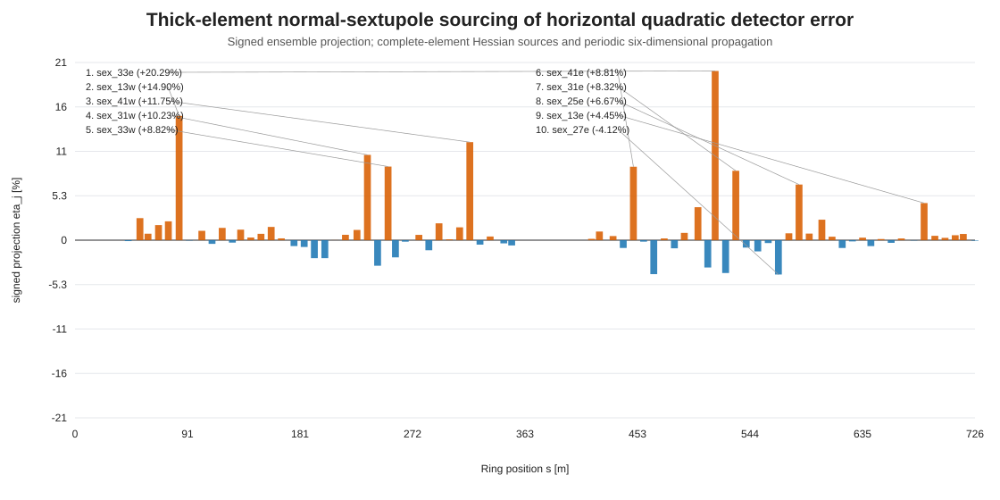

# Thick-element Hessian sourcing result

## Closure

- Directions: `100`; lattice elements: `869`; active normal sextupoles: `76`; detectors: `99`.
- All-element total relative closure: `8.99852e-15`.
- Sextupole-only HH / HV / VV relative closure: `0.484517 / 0.356591 / 0.199851`.
- Sextupole-only total relative closure: `0.2964`.
- Sextupole-only total signed projection: `0.920688`.
- Direction-level sextupole closure P10 / median / P90: `0.20905 / 0.310001 / 0.517462`.
- Direction-level signed projection P10 / median / P90: `0.775757 / 0.920837 / 0.970723`.
- Family partition maximum absolute reconstruction difference: `3.22931e-20 m`.

## Comparison with the midpoint thin-kick reconstruction

- Thin / thick total relative closure: `0.301381 / 0.2964`.
- Absolute closure improvement: `0.00498085`.
- Pearson correlation of the 76 signed `eta_total` values: `0.999999957283`.
- Maximum absolute change in an element `eta_total`: `5.77771e-05`.
- Top-15 absolute-projection ordering identical: `True`.

The near-identical ranking and small closure change show that the remaining residual is not primarily caused by treating the sextupoles as thin midpoint sources.

## Complete-element source families

Signed projections add to one; magnitude ratios do not add because family vectors interfere.

| family | elements | eta HH | eta HV | eta VV | eta total | magnitude total |
|---|---:|---:|---:|---:|---:|---:|
| `normal_sextupole` | 76 | +77.531% | +87.251% | +96.695% | +92.069% | 96.397% |
| `sbend` | 84 | +10.856% | +1.668% | +1.169% | +3.350% | 12.950% |
| `solenoid` | 6 | +0.702% | -0.945% | +1.271% | +1.790% | 8.708% |
| `drift` | 429 | +6.504% | +7.565% | +0.527% | +1.694% | 6.492% |
| `quadrupole` | 124 | +3.156% | +4.047% | +0.200% | +0.726% | 2.887% |
| `kicker` | 35 | +0.871% | +0.318% | +0.086% | +0.260% | 1.001% |
| `octupole` | 4 | +0.271% | +0.054% | +0.009% | +0.056% | 0.250% |
| `wiggler` | 2 | +0.032% | +0.027% | +0.035% | +0.036% | 0.123% |
| `rfcavity` | 4 | +0.069% | +0.012% | +0.006% | +0.018% | 0.100% |
| `other_sextupole` | 3 | +0.008% | +0.002% | +0.001% | +0.002% | 0.010% |
| `marker` | 102 | -0.000% | +0.000% | +0.000% | +0.000% | 0.000% |

### Direction-level family statistics

| family | eta P10 | eta median | eta P90 | magnitude median |
|---|---:|---:|---:|---:|
| `normal_sextupole` | +77.576% | +92.084% | +97.072% | 96.687% |
| `sbend` | +1.450% | +3.646% | +8.531% | 14.525% |
| `drift` | +0.421% | +1.635% | +5.687% | 6.824% |
| `solenoid` | +0.065% | +1.027% | +6.726% | 4.329% |
| `quadrupole` | +0.137% | +0.666% | +2.557% | 3.010% |
| `kicker` | +0.021% | +0.203% | +0.789% | 0.948% |
| `octupole` | -0.014% | +0.036% | +0.196% | 0.194% |
| `rfcavity` | +0.003% | +0.020% | +0.072% | 0.097% |
| `wiggler` | -0.004% | +0.019% | +0.117% | 0.095% |
| `other_sextupole` | +0.000% | +0.002% | +0.007% | 0.010% |
| `marker` | -0.000% | +0.000% | +0.000% | 0.000% |

## Largest absolute signed projections

| rank | sextupole | s [m] | K2L [m^-2] | eta total | magnitude ratio |
|---:|---|---:|---:|---:|---:|
| 1 | `sex_33e` | 516.053 | -0.49392 | +20.2866% | 62.0381% |
| 2 | `sex_13w` | 83.933 | 0.32584 | +14.8970% | 39.3025% |
| 3 | `sex_41w` | 318.272 | -0.49659 | +11.7548% | 38.8794% |
| 4 | `sex_31w` | 235.741 | -0.50427 | +10.2263% | 34.9083% |
| 5 | `sex_33w` | 252.373 | -0.49415 | +8.8247% | 47.7447% |
| 6 | `sex_41e` | 450.156 | -0.49661 | +8.8051% | 39.5661% |
| 7 | `sex_31e` | 532.687 | -0.50422 | +8.3181% | 31.9620% |
| 8 | `sex_25e` | 583.669 | -0.39789 | +6.6707% | 40.7182% |
| 9 | `sex_13e` | 684.498 | 0.326 | +4.4496% | 25.9633% |
| 10 | `sex_27e` | 567.035 | -0.40347 | -4.1153% | 24.1081% |
| 11 | `sex_39e` | 466.563 | -0.45728 | -4.0722% | 28.6663% |
| 12 | `sex_35e` | 502.186 | -0.16514 | +3.9537% | 19.9645% |
| 13 | `sex_32e` | 524.486 | 0.30635 | -3.9373% | 17.7580% |
| 14 | `sex_34e` | 510.105 | 0.17428 | -3.2730% | 25.3393% |
| 15 | `sex_32w` | 243.940 | 0.30628 | -3.0622% | 17.9052% |

## Interpretation boundary

The all-element closure validates the chain-rule source decomposition. The sextupole-only residual is retained explicitly and measures sources assigned to other complete lattice elements under this element-boundary convention.

