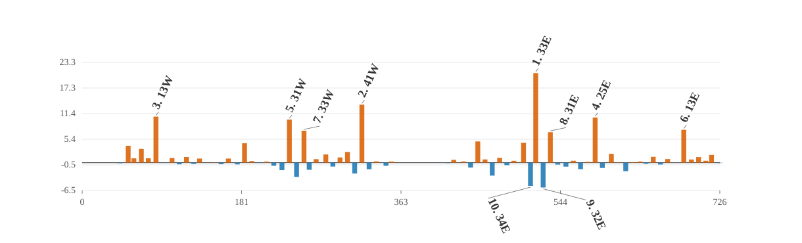

# Detector-y thick-element Hessian sourcing result

## Closure

- Directions: `100`; lattice elements: `869`; active normal sextupoles: `76`; detectors: `99`.
- All-element total relative closure: `1.07358e-14`.
- Sextupole-only HH / HV / VV relative closure: `0.378342 / 0.15653 / 0.203769`.
- Sextupole-only total relative closure: `0.15638`.
- Sextupole-only total signed projection: `0.978038`.
- Direction-level sextupole closure P10 / median / P90: `0.0104998 / 0.0811872 / 0.317316`.
- Direction-level signed projection P10 / median / P90: `0.876526 / 0.997993 / 1.04892`.
- Family partition maximum absolute reconstruction difference: `6.22569e-20 m`.
- HH / HV / VV target squared-norm shares: `0.004992% / 99.973665% / 0.021343%`.

## Complete-element source families

Signed projections add to one; magnitude ratios do not add because family vectors interfere.

| family | elements | eta HH | eta HV | eta VV | eta total | magnitude total |
|---|---:|---:|---:|---:|---:|---:|
| `normal_sextupole` | 76 | +88.835% | +97.835% | +99.789% | +97.804% | 99.022% |
| `solenoid` | 6 | -0.990% | +0.963% | +0.985% | +0.969% | 9.717% |
| `sbend` | 84 | +2.564% | +0.666% | -0.611% | +0.680% | 5.161% |
| `drift` | 429 | +6.015% | +0.311% | -0.075% | +0.319% | 2.295% |
| `quadrupole` | 124 | +3.038% | +0.127% | -0.021% | +0.129% | 0.914% |
| `kicker` | 35 | +0.388% | +0.062% | -0.084% | +0.063% | 0.440% |
| `wiggler` | 2 | +0.027% | +0.029% | +0.034% | +0.029% | 0.158% |
| `octupole` | 4 | +0.106% | +0.006% | -0.017% | +0.006% | 0.050% |
| `other_sextupole` | 3 | +0.003% | +0.000% | -0.000% | +0.000% | 0.005% |
| `rfcavity` | 4 | +0.015% | -0.000% | -0.001% | +0.000% | 0.060% |
| `marker` | 102 | -0.000% | -0.000% | +0.000% | -0.000% | 0.000% |

### Direction-level family statistics

| family | eta P10 | eta median | eta P90 | magnitude median |
|---|---:|---:|---:|---:|
| `normal_sextupole` | +87.653% | +99.799% | +104.892% | 100.030% |
| `sbend` | -3.280% | +0.216% | +3.082% | 3.033% |
| `drift` | -1.031% | +0.017% | +1.603% | 1.188% |
| `kicker` | -0.225% | +0.010% | +0.288% | 0.224% |
| `quadrupole` | -0.306% | +0.008% | +0.768% | 0.490% |
| `solenoid` | -2.841% | +0.008% | +5.158% | 3.547% |
| `wiggler` | -0.046% | +0.008% | +0.128% | 0.126% |
| `octupole` | -0.017% | +0.002% | +0.026% | 0.024% |
| `rfcavity` | -0.030% | +0.001% | +0.025% | 0.027% |
| `other_sextupole` | -0.002% | +0.000% | +0.003% | 0.003% |
| `marker` | -0.000% | -0.000% | +0.000% | 0.000% |

## Largest absolute signed projections

| rank | sextupole | s [m] | K2L [m^-2] | eta total | magnitude ratio |
|---:|---|---:|---:|---:|---:|
| 1 | `sex_33e` | 516.053 | -0.49392 | +20.7955% | 65.6150% |
| 2 | `sex_41w` | 318.272 | -0.49659 | +13.4673% | 51.0249% |
| 3 | `sex_13w` | 83.933 | 0.32584 | +10.6977% | 32.4452% |
| 4 | `sex_25e` | 583.669 | -0.39789 | +10.4883% | 46.0087% |
| 5 | `sex_31w` | 235.741 | -0.50427 | +10.0055% | 43.4866% |
| 6 | `sex_13e` | 684.498 | 0.326 | +7.6440% | 29.7240% |
| 7 | `sex_33w` | 252.373 | -0.49415 | +7.4266% | 52.6451% |
| 8 | `sex_31e` | 532.687 | -0.50422 | +7.0814% | 39.0227% |
| 9 | `sex_32e` | 524.486 | 0.30635 | -5.7666% | 20.6693% |
| 10 | `sex_34e` | 510.105 | 0.17428 | -5.3923% | 18.0354% |
| 11 | `sex_41e` | 450.156 | -0.49661 | +4.9286% | 45.3462% |
| 12 | `sex_35e` | 502.186 | -0.16514 | +4.6008% | 21.1022% |
| 13 | `sex_25w` | 184.758 | -0.39794 | +4.5046% | 39.5964% |
| 14 | `sex_09w` | 52.350 | -0.24198 | +3.9241% | 17.5167% |
| 15 | `sex_32w` | 243.940 | 0.30628 | -3.3178% | 16.7184% |

## Interpretation boundary

The all-element closure validates the chain-rule source decomposition. The sextupole-only residual is retained explicitly and measures sources assigned to other complete lattice elements under this element-boundary convention.

