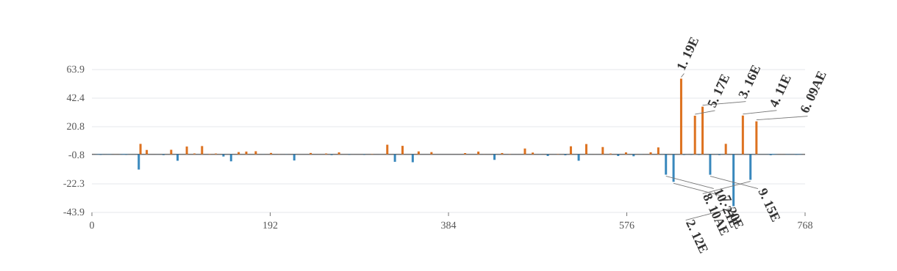

# Detector-y complete-element nonlinear-error attribution

## Summed nonlinear target and vector closure

- Directions: `1`; lattice elements: `1177`; active normal sextupoles: `76`; detectors: `144`.
- All-element total relative closure: `1.2761e-14`.
- Ensemble total signed projection of all element vectors: `1`.
- Direction-level total closure P10 / median / P90: `1.2761e-14 / 1.2761e-14 / 1.2761e-14`.
- Direction-level signed projection P10 / median / P90: `1 / 1 / 1`.
- Family-vector partition maximum absolute error: `2.34258e-20 m`.
- Family-vector partition relative closure maximum: `1.56494e-14`.
- Direction-level family partition relative closure P10 / median / P90: `1.56494e-14 / 1.56494e-14 / 1.56494e-14`.

The target is the summed leading second-order nonlinear detector vector. Signed projections are additive; magnitude ratios are not, because family vectors interfere.

## Complete-element source families

| family | elements | eta total | magnitude total |
|---|---:|---:|---:|
| `normal_sextupole` | 76 | +111.638% | 116.730% |
| `drift` | 562 | -4.275% | 12.857% |
| `sbend` | 98 | -3.519% | 11.742% |
| `kicker` | 82 | -1.862% | 5.781% |
| `quadrupole` | 122 | -1.651% | 5.039% |
| `rfcavity` | 4 | -0.186% | 0.420% |
| `wiggler` | 3 | -0.143% | 0.325% |
| `other_sextupole` | 6 | -0.004% | 0.011% |
| `octupole` | 2 | +0.002% | 0.041% |
| `marker` | 222 | +0.000% | 0.000% |

### Direction-level family statistics

| family | eta P10 | eta median | eta P90 | magnitude median |
|---|---:|---:|---:|---:|
| `normal_sextupole` | +111.638% | +111.638% | +111.638% | 116.730% |
| `drift` | -4.275% | -4.275% | -4.275% | 12.857% |
| `sbend` | -3.519% | -3.519% | -3.519% | 11.742% |
| `kicker` | -1.862% | -1.862% | -1.862% | 5.781% |
| `quadrupole` | -1.651% | -1.651% | -1.651% | 5.039% |
| `rfcavity` | -0.186% | -0.186% | -0.186% | 0.420% |
| `wiggler` | -0.143% | -0.143% | -0.143% | 0.325% |
| `other_sextupole` | -0.004% | -0.004% | -0.004% | 0.011% |
| `octupole` | +0.002% | +0.002% | +0.002% | 0.041% |
| `marker` | +0.000% | +0.000% | +0.000% | 0.000% |

## Largest absolute signed projections

| rank | element | type | s [m] | K2L [m^-2] | eta total | magnitude ratio |
|---:|---|---|---:|---:|---:|---:|
| 1 | `sex_19e` | `Sextupole` | 634.903 | -0.51074 | +57.0932% | 129.6535% |
| 2 | `sex_12e` | `Sextupole` | 691.316 | 0.4724 | -39.1840% | 74.7528% |
| 3 | `sex_16e` | `Sextupole` | 657.971 | 0.39624 | +35.9551% | 70.2273% |
| 4 | `sex_11e` | `Sextupole` | 701.377 | -0.50372 | +29.2460% | 61.7273% |
| 5 | `sex_17e` | `Sextupole` | 649.763 | -0.81155 | +29.1145% | 52.1330% |
| 6 | `sex_09ae` | `Sextupole` | 716.025 | 0.18074 | +24.8776% | 69.3988% |
| 7 | `sex_20e` | `Sextupole` | 626.694 | 0.4611 | -20.8162% | 38.8185% |
| 8 | `sex_10ae` | `Sextupole` | 709.582 | -0.16064 | -19.2803% | 46.3957% |
| 9 | `sex_15e` | `Sextupole` | 666.177 | -0.49899 | -15.4591% | 86.2048% |
| 10 | `sex_21e` | `Sextupole` | 618.490 | -1.0268 | -15.4022% | 33.8632% |
| 11 | `sex_09aw` | `Sextupole` | 50.513 | 0.6125 | -11.5352% | 30.4468% |
| 12 | `sex_13e` | `Sextupole` | 683.013 | -0.61291 | +7.8816% | 16.2874% |
| 13 | `sex_10w` | `Sextupole` | 52.359 | -0.24067 | +7.8581% | 20.6796% |
| 14 | `sex_31e` | `Sextupole` | 532.693 | -1.0364 | +7.7318% | 55.8502% |
| 15 | `sex_41w` | `Sextupole` | 318.278 | -0.97331 | +7.2334% | 24.3432% |

## Interpretation boundary

The all-element vector closure validates the chain-rule source decomposition. Family projections describe propagated source vectors under the complete-element boundary convention; they are not hardware-fault probabilities.

