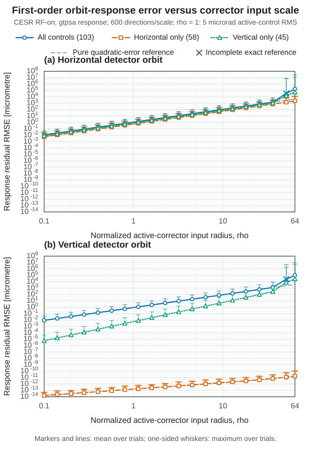

# Chapter 1 results: nonlinear closed-orbit response-radius sweep

Status: `production_complete`.

## Provenance

- Ring: `latest_cesr`; RF on; branch `0`.
- Lattice: `D:/Ring_Design_Development/CESR Project/Latest_Lattice/latest_cesr_scibmad_repaired.jl`.
- Engine: `SciBmad 0.4.1`.
- Response: `gtpsa`; `103` controls and `288` ordered detector observables.
- Directions: `600` per positive radius and input scenario; seed `20260803`; `rho=1` is `5` microradian active-control RMS.

## Numerical completion

- Unique exact states: `36001`; converged: `36000`; failed: `1`.
- Recorded fallback count across chunks: `63`.
- Maximum reported closed-orbit closure norm: `9.999996e-14`.
- First sampled all-control radius with mean horizontal residual at least 1 micrometre: `1.13`.
- First sampled all-control radius with mean vertical residual at least 1 micrometre: `1.13`.
- Incomplete exact reference retained in the survival boundary: sample `30392` (`all`, `rho=51.2`, trial `392`, closure `4.35066`).

The crossing statements refer to the discrete sampled radii, not interpolated operating limits. Corrector power-supply, aperture, lifetime, and machine-protection constraints are not represented.

## Paper artifacts

- `tables/rho_response_paper_radii.csv` and `tables/rho_response_paper_radii.tex` contain the five matched-benchmark radii.
- `figures/scibmad_orbit_response_error_stacked.svg` and `.pdf` reproduce the paper's stacked response-error layout.
- The rho-squared-normalized companion is a model-validity diagnostic and is not required in the main manuscript.

