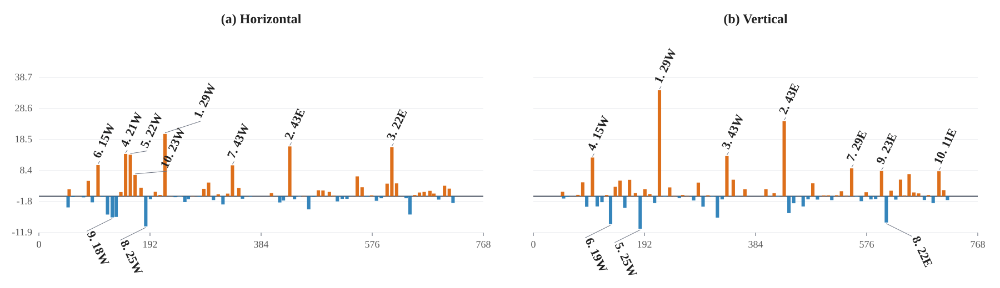

# Chapter 2 results: complete lattice-element attribution

Status: `production_complete`.

## Provenance

- Ring: `latest_cesr`; RF on; branch `0`.
- Lattice: `D:/Ring_Design_Development/CESR Project/Latest_Lattice/latest_cesr_scibmad_repaired.jl`.
- Engine: `SciBmad 0.4.1`.
- Ensemble: `100` paired directions per output plane; seed `20260804`; base kick `5` microradian.
- Runtime inventory: `1177` complete elements, `76` active normal sextupoles, and `144` detectors.

## Numerical closure

- Horizontal all-element relative vector closure: `1.308639e-14`; signed projection: `1`.
- Vertical all-element relative vector closure: `1.311835e-14`; signed projection: `1`.
- Normal-sextupole signed projections: `+96.508%` in x and `+98.647%` in y.
- Normal-sextupole magnitude ratios: `99.295%` in x and `99.859%` in y.

Signed projections may be negative or exceed 100% for individual families because propagated source vectors interfere. Magnitude ratios are not additive and must not be interpreted as positive error shares.

## Paper artifacts

- `tables/family_attribution.csv` and `tables/family_attribution.tex` reproduce the paper's paired family table format.
- `figures/normal_sextupole_signed_contributions_paired.svg` and `.pdf` reproduce the paper's paired normal-sextupole layout.
- `figures/all_element_signed_contributions_paired.svg` and `.pdf` retain the complete-element view used to audit the decomposition.

