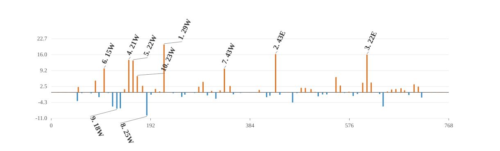

# Detector-x complete-element nonlinear-error attribution

## Summed nonlinear target and vector closure

- Directions: `100`; lattice elements: `1177`; active normal sextupoles: `76`; detectors: `144`.
- All-element total relative closure: `1.30864e-14`.
- Ensemble total signed projection of all element vectors: `1`.
- Direction-level total closure P10 / median / P90: `3.91991e-15 / 1.05545e-14 / 1.74524e-14`.
- Direction-level signed projection P10 / median / P90: `1 / 1 / 1`.
- Family-vector partition maximum absolute error: `1.32561e-19 m`.
- Family-vector partition relative closure maximum: `3.08451e-14`.
- Direction-level family partition relative closure P10 / median / P90: `7.84564e-15 / 1.45655e-14 / 2.48745e-14`.

The target is the summed leading second-order nonlinear detector vector. Signed projections are additive; magnitude ratios are not, because family vectors interfere.

## Complete-element source families

| family | elements | eta total | magnitude total |
|---|---:|---:|---:|
| `normal_sextupole` | 76 | +96.508% | 99.295% |
| `sbend` | 98 | +1.702% | 11.993% |
| `drift` | 562 | +1.008% | 6.843% |
| `kicker` | 82 | +0.395% | 2.480% |
| `quadrupole` | 122 | +0.357% | 2.349% |
| `rfcavity` | 4 | +0.021% | 0.146% |
| `wiggler` | 3 | +0.005% | 0.067% |
| `octupole` | 2 | +0.003% | 0.028% |
| `other_sextupole` | 6 | +0.002% | 0.015% |
| `marker` | 222 | +0.000% | 0.000% |

### Direction-level family statistics

| family | eta P10 | eta median | eta P90 | magnitude median |
|---|---:|---:|---:|---:|
| `normal_sextupole` | +90.452% | +96.590% | +101.268% | 99.178% |
| `sbend` | -0.846% | +1.976% | +5.248% | 12.542% |
| `drift` | -0.241% | +0.900% | +2.659% | 6.493% |
| `quadrupole` | -0.045% | +0.296% | +0.915% | 2.265% |
| `kicker` | -0.013% | +0.282% | +1.086% | 2.369% |
| `rfcavity` | -0.002% | +0.018% | +0.078% | 0.102% |
| `wiggler` | -0.007% | +0.002% | +0.027% | 0.042% |
| `octupole` | -0.004% | +0.002% | +0.010% | 0.024% |
| `other_sextupole` | -0.001% | +0.002% | +0.006% | 0.016% |
| `marker` | -0.000% | +0.000% | +0.000% | 0.000% |

## Largest absolute signed projections

| rank | element | type | s [m] | K2L [m^-2] | eta total | magnitude ratio |
|---:|---|---|---:|---:|---:|---:|
| 1 | `sex_29w` | `Sextupole` | 218.031 | -0.87084 | +20.3038% | 57.2970% |
| 2 | `sex_43e` | `Sextupole` | 433.752 | -0.65455 | +16.2302% | 57.8059% |
| 3 | `sex_22e` | `Sextupole` | 610.288 | 0.83674 | +16.0055% | 49.7399% |
| 4 | `sex_21w` | `Sextupole` | 149.944 | -1.0297 | +13.7868% | 54.5218% |
| 5 | `sex_22w` | `Sextupole` | 158.151 | 0.73385 | +13.5229% | 45.6656% |
| 6 | `sex_15w` | `Sextupole` | 102.263 | -0.94264 | +10.1661% | 32.6751% |
| 7 | `sex_43w` | `Sextupole` | 334.682 | -0.64082 | +10.0764% | 35.4625% |
| 8 | `sex_25w` | `Sextupole` | 184.763 | -0.46111 | -9.8387% | 25.7719% |
| 9 | `sex_18w` | `Sextupole` | 126.869 | 0.23297 | -6.9129% | 17.9378% |
| 10 | `sex_23w` | `Sextupole` | 166.355 | -1.0421 | +6.9110% | 26.6499% |
| 11 | `sex_19w` | `Sextupole` | 133.535 | -0.44348 | -6.7722% | 25.1025% |
| 12 | `sex_29e` | `Sextupole` | 550.406 | -0.72099 | +6.4610% | 23.9601% |
| 13 | `sex_17w` | `Sextupole` | 118.671 | -0.76891 | -5.9912% | 33.0975% |
| 14 | `sex_18e` | `Sextupole` | 641.563 | 0.22633 | -5.9761% | 17.4699% |
| 15 | `sex_13w` | `Sextupole` | 85.425 | -0.64146 | +4.9842% | 34.5690% |

## Interpretation boundary

The all-element vector closure validates the chain-rule source decomposition. Family projections describe propagated source vectors under the complete-element boundary convention; they are not hardware-fault probabilities.

