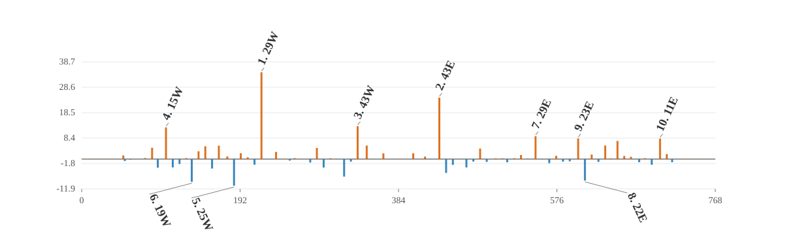

# Detector-y complete-element nonlinear-error attribution

## Summed nonlinear target and vector closure

- Directions: `100`; lattice elements: `1177`; active normal sextupoles: `76`; detectors: `144`.
- All-element total relative closure: `1.31183e-14`.
- Ensemble total signed projection of all element vectors: `1`.
- Direction-level total closure P10 / median / P90: `4.30833e-15 / 1.03e-14 / 1.72338e-14`.
- Direction-level signed projection P10 / median / P90: `1 / 1 / 1`.
- Family-vector partition maximum absolute error: `1.37219e-19 m`.
- Family-vector partition relative closure maximum: `2.97174e-14`.
- Direction-level family partition relative closure P10 / median / P90: `8.4574e-15 / 1.40528e-14 / 2.24481e-14`.

The target is the summed leading second-order nonlinear detector vector. Signed projections are additive; magnitude ratios are not, because family vectors interfere.

## Complete-element source families

| family | elements | eta total | magnitude total |
|---|---:|---:|---:|
| `normal_sextupole` | 76 | +98.647% | 99.859% |
| `drift` | 562 | +0.502% | 5.128% |
| `sbend` | 98 | +0.384% | 6.833% |
| `kicker` | 82 | +0.246% | 1.966% |
| `quadrupole` | 122 | +0.203% | 1.830% |
| `rfcavity` | 4 | +0.017% | 0.135% |
| `wiggler` | 3 | +0.001% | 0.074% |
| `other_sextupole` | 6 | +0.000% | 0.009% |
| `octupole` | 2 | -0.000% | 0.025% |
| `marker` | 222 | -0.000% | 0.000% |

### Direction-level family statistics

| family | eta P10 | eta median | eta P90 | magnitude median |
|---|---:|---:|---:|---:|
| `normal_sextupole` | +89.809% | +99.775% | +108.184% | 99.875% |
| `sbend` | -4.430% | +0.132% | +4.532% | 4.026% |
| `kicker` | -0.663% | +0.080% | +1.444% | 1.263% |
| `drift` | -2.527% | +0.050% | +3.082% | 3.064% |
| `quadrupole` | -0.835% | +0.022% | +1.194% | 1.160% |
| `wiggler` | -0.037% | -0.001% | +0.039% | 0.046% |
| `octupole` | -0.013% | -0.001% | +0.015% | 0.014% |
| `rfcavity` | -0.069% | +0.000% | +0.095% | 0.073% |
| `other_sextupole` | -0.006% | +0.000% | +0.006% | 0.006% |
| `marker` | -0.000% | -0.000% | +0.000% | 0.000% |

## Largest absolute signed projections

| rank | element | type | s [m] | K2L [m^-2] | eta total | magnitude ratio |
|---:|---|---|---:|---:|---:|---:|
| 1 | `sex_29w` | `Sextupole` | 218.031 | -0.87084 | +34.5534% | 91.3215% |
| 2 | `sex_43e` | `Sextupole` | 433.752 | -0.65455 | +24.4706% | 71.4934% |
| 3 | `sex_43w` | `Sextupole` | 334.682 | -0.64082 | +13.0895% | 42.7497% |
| 4 | `sex_15w` | `Sextupole` | 102.263 | -0.94264 | +12.6086% | 41.7769% |
| 5 | `sex_25w` | `Sextupole` | 184.763 | -0.46111 | -10.6068% | 37.1971% |
| 6 | `sex_19w` | `Sextupole` | 133.535 | -0.44348 | -9.0892% | 35.0856% |
| 7 | `sex_29e` | `Sextupole` | 550.406 | -0.72099 | +9.0866% | 33.4250% |
| 8 | `sex_22e` | `Sextupole` | 610.288 | 0.83674 | -8.5782% | 32.7047% |
| 9 | `sex_23e` | `Sextupole` | 602.084 | -0.73358 | +8.2035% | 29.6206% |
| 10 | `sex_11e` | `Sextupole` | 701.377 | -0.50372 | +8.1429% | 25.9650% |
| 11 | `sex_17e` | `Sextupole` | 649.763 | -0.81155 | +7.2149% | 32.2637% |
| 12 | `sex_41w` | `Sextupole` | 318.278 | -0.97331 | -6.9811% | 33.2139% |
| 13 | `sex_42e` | `Sextupole` | 441.960 | 0.48986 | -5.5228% | 21.4846% |
| 14 | `sex_19e` | `Sextupole` | 634.903 | -0.51074 | +5.3982% | 28.1672% |
| 15 | `sex_44w` | `Sextupole` | 345.687 | -0.45463 | +5.3632% | 24.7673% |

## Interpretation boundary

The all-element vector closure validates the chain-rule source decomposition. Family projections describe propagated source vectors under the complete-element boundary convention; they are not hardware-fault probabilities.

