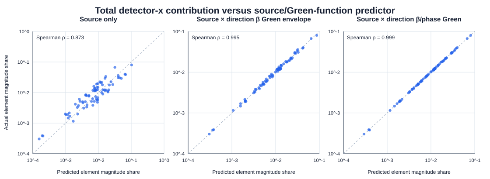
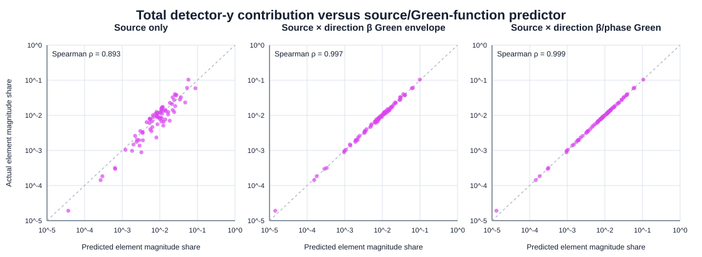

# Latest-CESR normal-sextupole source--beta--phase predictor

## Scope

The target is the total second-order nonlinear detector vector `(Qx, Qy)`. Exact complete-element SciBmad Hessian sources are used for the signed normal-sextupole contribution; no hh/hv/vv block shares or third-order terms are reported.

The predictors use the same sextupole source kick and detector set as the contribution table. They are physical ranking predictors, not replacements for the exact coupled six-dimensional source transport.

## Green-function predictors

For each transverse plane, the uncoupled reference Green function is `G_ij = sqrt(beta_i beta_j)/(2 sin(pi Q)) cos(2 pi |phi_i-phi_j| - pi Q)`. The envelope predictor uses `|source| ||G_env||_2`; the phase predictor uses `|source| ||G_ij||_2` over the configured detector registry. The source-only predictor is the absolute signed local normal-sextupole source kick reconstructed from the direction-matched first-order orbit; that kick already includes `K2L`.

## Correlations

| plane | predictor | pooled Spearman | pooled log Pearson | direction Spearman median [P10, P90] | element Spearman | element log Pearson |
|---|---|---:|---:|---:|---:|---:|
| x | `source_only` | 0.9404 | 0.9537 | 0.9414 [0.9414, 0.9414] | 0.8730 | 0.9305 |
| x | `nominal_beta_envelope` | 0.9984 | 0.9991 | 0.9977 [0.9970, 0.9984] | 0.9954 | 0.9985 |
| x | `direction_beta_envelope` | 0.9984 | 0.9990 | 0.9977 [0.9970, 0.9984] | 0.9953 | 0.9983 |
| x | `nominal_beta_phase` | 0.9998 | 0.9999 | 0.9996 [0.9995, 0.9997] | 0.9992 | 0.9999 |
| x | `direction_beta_phase` | 0.9998 | 0.9999 | 0.9996 [0.9996, 0.9997] | 0.9990 | 0.9999 |
| y | `source_only` | 0.9559 | 0.9721 | 0.9520 [0.9517, 0.9523] | 0.8928 | 0.9577 |
| y | `nominal_beta_envelope` | 0.9989 | 0.9994 | 0.9987 [0.9987, 0.9987] | 0.9971 | 0.9990 |
| y | `direction_beta_envelope` | 0.9989 | 0.9994 | 0.9988 [0.9987, 0.9988] | 0.9972 | 0.9990 |
| y | `nominal_beta_phase` | 0.9998 | 0.9998 | 0.9996 [0.9996, 0.9997] | 0.9995 | 0.9996 |
| y | `direction_beta_phase` | 0.9998 | 0.9998 | 0.9997 [0.9996, 0.9997] | 0.9995 | 0.9996 |

## Direction-optics variation from nominal

| quantity | median absolute relative change | P90 | maximum |
|---|---:|---:|---:|
| `beta_x_sext_m` | 6.767e-03 | 1.760e-02 | 2.641e-02 |
| `beta_y_sext_m` | 1.940e-03 | 4.766e-03 | 9.353e-03 |
| `envelope_x_l2_m` | 3.683e-03 | 8.870e-03 | 1.489e-02 |
| `phase_x_l2_m` | 1.204e-03 | 3.702e-03 | 6.145e-03 |
| `envelope_y_l2_m` | 9.557e-04 | 2.923e-03 | 5.522e-03 |
| `phase_y_l2_m` | 6.811e-04 | 1.841e-03 | 4.515e-03 |

## Interpretation boundary

A correlation increase from source-only to the beta envelope measures the ranking information supplied by the beta response amplitude. A further increase for the phase-aware Green function measures the value of phase advance. Direction-matched optics retain the orbit-dependent operating point, while nominal optics are a fixed reference. This is an association/predictor study, not a controlled beta-beating scan.

The exact contribution retains coupled six-dimensional transport and finite-element source terms. The predictor uses same-plane uncoupled Twiss quantities, so residual disagreement is expected from cross-plane coupling, finite-length sourcing, and non-sextupole sources.

- Contributions: `D:\Ring_Design_Development\CESR Project\orbit\error_analysis\sextupole_detector_contributions\smoke\latest_cesr\sextupole_direction_contributions.csv`
- Closure: `D:\Ring_Design_Development\CESR Project\orbit\error_analysis\sextupole_detector_contributions\smoke\latest_cesr\direction_closure.csv`
- Nominal optics: `D:\Ring_Design_Development\CESR Project\orbit\error_analysis\sextupole_beta_phase_correlation\smoke\latest_cesr\nominal_optics_points.csv`
- Direction optics: `D:\Ring_Design_Development\CESR Project\orbit\error_analysis\sextupole_beta_phase_correlation\smoke\latest_cesr\direction_optics_points.csv`

