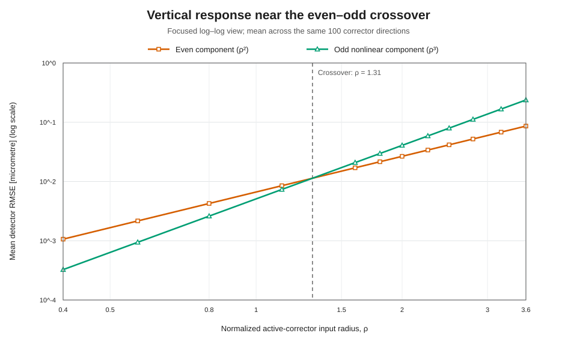
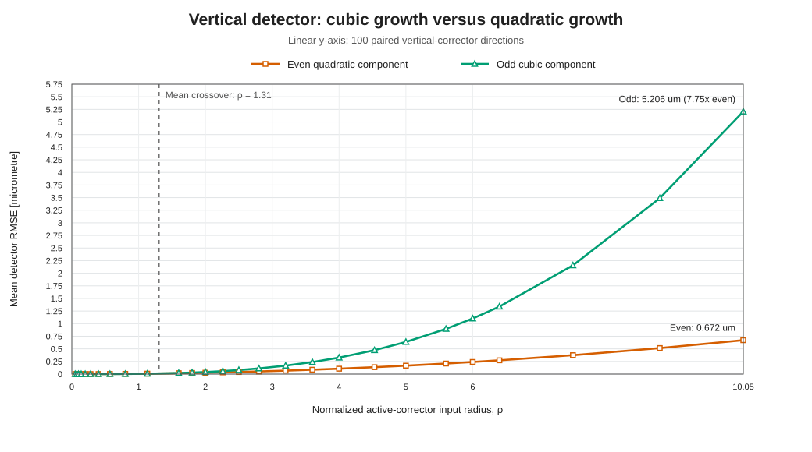
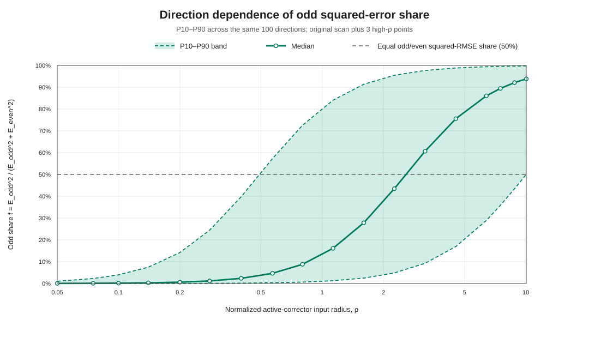

# Vertical-corrector signed-parity experiment

Date: 2026-08-04

## Contents

- `run_vertical_parity_experiment.jl`: generate paired positive/negative
  SciBmad closed-orbit states and write pair-level and radius-level CSV data.
- `analyze_vertical_parity.py`: compute local scaling slopes, write the compact
  Markdown analysis, direction-percentile CSV, and dependency-free SVG figures.
- `results/`: default output directory for generated CSV, TOML, Markdown, and
  SVG artifacts. The analysis writes exactly three principal figures: a focused
  log-log crossover view, a full-range linear odd/even growth view, and the
  bounded odd-share direction-percentile view.

From `CESR Project`, run:

```console
julia --project=. orbit/error_analysis/vertical_parity/run_vertical_parity_experiment.jl
python orbit/error_analysis/vertical_parity/analyze_vertical_parity.py \
  orbit/error_analysis/vertical_parity/results/vertical_parity_summary.csv
```

The Python analysis uses only the standard library.

## Figures



This first figure is restricted to `0.4 <= rho <= 3.6`: on log-log axes the
quadratic even and cubic odd components appear as two nearly straight lines,
making their crossing near `rho = 1.31` the focus.





The percentile plots use the original 15 radii plus three high-radius extension
points (`rho = 7.5, 8.8, 10.05`). At each radius, the metric is calculated
separately for all 100 fixed 61-dimensional corrector directions, then the P10,
median, and P90 are taken across directions. The adopted metric is

```text
f = E_odd^2 / (E_odd^2 + E_even^2).
```

Thus `f = 50%` is the equal odd/even RMSE criterion. The fraction is bounded and
is an exact share of the sign-averaged squared residual.

This experiment tests the early departure of the `vertical-only -> detector y`
first-order-response residual from quadratic scaling. For each of 100 fixed
Gaussian vertical-corrector directions, SciBmad evaluated both signs at 15
radii from `rho = 0.05` to `6.4`, plus 9 refinement radii for a smoother curve
and 3 high-radius points at `rho = 7.5, 8.8, 10.05`. The same directions and seed were
reused at every radius; no directions were regenerated. Here `rho = 1` is
`5 microrad` active-corrector RMS. Including the shared nominal state, all
`5,401 / 5,401`
nonlinear closed-orbit states converged, with no full-Newton fallback and a
maximum closure norm of `9.994e-14`.

For each detector plane `u`, the paired components are

```text
even   = (u(+delta_k) + u(-delta_k)) / 2 - u(0)
odd_nl = (u(+delta_k) - u(-delta_k)) / 2 - J_u delta_k.
```

Thus `even` contains second and higher even orders, while `odd_nl` is the odd
part after removal of the nominal first-order response.

## Main result

The vertical detector orbit separates cleanly into a small quadratic even
component and a cubic odd-nonlinear component:

- `mean(y_even_RMSE) / rho^2 = 0.006652 micrometre` at the smallest radius and
  remains constant to the displayed precision; its final local slope is
  `2.00035`.
- `mean(y_odd_nl_RMSE) / rho^3` is approximately
  `0.00509 micrometre`; its local slope is `3.000` through most of the scan and
  `3.00456` at the final point.
- The ratio of mean odd-nonlinear to mean even RMSE grows approximately
  linearly with `rho`: `0.0765` at `rho = 0.1`, `0.865` at `rho = 1.13`,
  `1.224` at `rho = 1.6`, `2.450` at `rho = 3.2`, and `4.911` at `rho = 6.4`.
- The mean components cross near `rho = 1.31`, corresponding to about
  `6.5 microrad` active-corrector RMS.

The horizontal detector orbit provides the expected control case. Its even
component has final local slope `2.001`, while its odd-nonlinear/even ratio is
only `3.05e-4` at `rho = 6.4`. Vertical-corrector `x` error is therefore
overwhelmingly even/quadratic over the tested range.

## Direction dependence

The transition is not simultaneous for every random direction. The fraction
of directions with `y_odd_nl_RMSE > y_even_RMSE` is `18%` at `rho = 0.8`,
`36%` at `rho = 1.6`, `46%` at `rho = 2.26`, `64%` at `rho = 3.2`, and `80%`
at `rho = 6.4`. There the median odd/even ratio is `2.48`, with a
10th-to-90th percentile range of approximately `0.64` to `13.0`.

At the extension endpoint `rho = 10.05`, the P10 odd fraction is `50.06%`, so
the lower edge of the P10–P90 band reaches the equal-contribution line. The
median and P90 odd fractions there are `93.84%` and `99.76%`, respectively.

## Interpretation and remaining question

The experiment directly confirms that the early transition of the aggregate
`vertical-only -> y` residual is caused by a cubic odd response overtaking a
small quadratic even response. Together with the large quadratic
`vertical-only -> x` channel, this supports the midplane-parity selection-rule
interpretation. It does not yet identify which elements generate the cubic
coefficient. The next discriminating study is a normal-sextupole and octupole
strength/ablation scan, with a symmetry-restored lattice as a separate test of
the small nonzero even coefficient.
